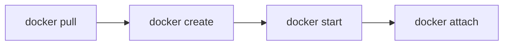

+++
title = "Docker Basic"
weight = 1
+++

### Docker Hub에서 Image Download

Docker pull command를 사용하여 DockerHub 에 등록된 이미지 다운로드 합니다. 다운로드할 이미지는 ubuntu 18.04 이미지입니다.

```sh
$sudo docker pull ubuntu:18.04
18.04: Pulling from library/ubuntu
5c939e3a4d10:Pull complete
c63719cdbe7a: Pull complete
19a861ea6baf: Pull complete
651c9d2d6c4f: Pull complete
Digest: sha256:8d31dad0c58f552e890d68bbfb735588b6b820a46e459672d96e585871acc110
```

### 설치된 Docker Image 확인하기

**docker images** 명령어를 이용하여 설치된 도커 이미지들의 리스트를 확인할 수 있습니다. 제 PC 설치된 이미지 리스트는 아래와 같습니다. 총 5가지 이미지가 설치되어 있네요.

```sh
$sudo docker images
REPOSITORY          TAG                 IMAGE ID            CREATED             SIZE
ubuntu              18.04               ccc6e87d482b        3 days ago          64.2MB
mysql               5.7                 b598110d0fff        4 days ago          435MB
wordpress           latest              1b1624b63467        3 weeks ago         539MB
node                6.11.5              852391892b9f        2 years ago         662MB
```

REPOSITORY와 TAG명 그리고 IMAGE ID가 보입니다. IMAGE ID는 16진수 해쉬값으로 구성되어 있습니다. 그리고 CREATE로 이미지가 생성된 일자, 이미지의 사이즈까지 확인할 수 있습니다.


### Docker Container 생성하기

##### 1. docker create

**docker create** 명령어를 실행하여 컨테이너를 생성할 수 있습니다.

```sh
$sudo docker create -i -t ubuntu:18.04
9f1be16cd91b3673ac95d77eaf0906405c335f4aaed9e77520a245fa0b33299f
```

이 명령어로 컨테이너를 생성할 시에 랜덤한 16진수 해쉬값이 생성되며, 이 해쉬값은 생성한 컨테이너의 ID가 됩니다.


##### 2. docker run

**docker run** 명렁어를 사용하여 컨테이너를 생성하고 실행할 수 있습니다.
'-i -t' 옵션은 각각 입출력과, tty 활성화를 요청하는 옵션입니다. 해당 옵션을 제외하고 실행 시 사용자와의 인터페이스가 실행되지 않고, 컨테이너가 실행된 직 후 바로 종료됩니다.

**docker pull** 로 다운받은 ubuntu 18.04 이미지를 실행하여 보겠습니다.

```sh
$sudo docker run -i -t ubuntu:18.04
root@f54e84f31187:/# ps
PID TTY          TIME CMD
1 pts/0    00:00:00 bash
10 pts/0    00:00:00 ps
root@f54e84f31187:/# exit
exit
```

##### 3. docker create 와 docker run 의 차이점

**docker create**와 **docker run**의 차이는 컨테이너를 생성하는 것 까지와 생성 후 실행까지 시키느냐에 따른 차이입니다. 아래  이미지에서 docker pull은 컨테이너로 실행할 이미지가 없는 경우 필요한 단계이며, **docker create**는 create 단계에서 멈추며, **docker run**은 start 이후 attach가 동작하게 됩니다.



### Container 목록 및 정보 확인하기

```sh
$sudo docker ps           
CONTAINER ID     IMAGE            COMMAND          CREATED          STATUS           PORTS            NAMES
$sudo docker ps -a
CONTAINER ID     IMAGE            COMMAND          CREATED          STATUS           PORTS            NAMES
9f1be16cd91b     ubuntu:18.04     "/bin/bash"      12 minutes ago   Created                     vigorous_lumiere
```

**docker ps** 명령어는 컨테이너의 리스트를 보여줍니다. **docker images**와는 리스트를 보여주는 것은 같으나, 컨테이너 리스트인지 이미지 리스트인지의 차이입니다. **-a**옵션은 정지된 컨테이너까지 포함하여 출력하여 줍니다.

특정 컨테이너의 상세한 정보를 보기 위해서 **inspect** 명령어를 사용할 수 있습니다. **inspect** 명령어는 container 내부 명령어인데요, container 외에도 image, volume 등에도 사용이 가능합니다. 사용 방법은 아래와 같습니다.

```sh
$sudo docker ps -a
CONTAINER ID        IMAGE               COMMAND             CREATED             STATUS              PORTS               NAMES
9f1be16cd91b        ubuntu:18.04        "/bin/bash"         16 minutes ago      Created                                 vigorous_lumiere

// docker ps 명령어로 존재하는 컨테이너를 확인하고 inspect 명령어로 상세 정보를 확인하면 아래처럼 출력됩니다.

$sudo docker container inspect vigorous_lumiere | more
[
    {
        "Id": "9f1be16cd91b3673ac95d77eaf0906405c335f4aaed9e77520a245fa0b33299f",
        "Created": "2020-01-19T13:33:00.518174743Z",
        "Path": "/bin/bash",
        "Args": [],
        "State": {
            "Status": "created",
            "Running": false,
            "Paused": false,
...
```

### Container 삭제하기

**docker rm** 명령어와 **docker container prune** 명령어를 이용하여 컨테이너를 삭제할 수 있다.

```sh
$sudo docker ps -a         
CONTAINER ID        IMAGE               COMMAND             CREATED             STATUS              PORTS               NAMES
9f1be16cd91b        ubuntu:18.04        "/bin/bash"         20 minutes ago      Created                                 vigorous_lumiere
$sudo docker rm vigorous_lumiere
vigorous_lumiere
$sudo docker ps -a 
CONTAINER ID        IMAGE               COMMAND             CREATED             STATUS              PORTS               NAMES
```

존재하던 컨테이너가 **docker rm** 명령어 이후 삭제되었음을 확인하였습니다. 다양한 컨테이너를 다루다 너무 많은 컨테이너가 생성되었을 경우에는 **docker rm** 명령어로 하나씩 삭제하기가 번거롭습니다. 그때 **docker container prune** 명령어로 모두 삭제가 가능합니다.


### Container IP 확인하기

ubuntu:18.04 이미지를 다운받아 컨테이너로 생성하여 실행하게 되면 네트워크 정보들 간단히 IP 확인하기 위한 ifconfig 툴도 설치가 되어있지 않습니다. ifconfig를 이용하여 ip를 확인하는데, 만약 ifconfig가 설치되어 있지 않다면 net-tools를 설치해줍니다

```sh
$sudo docker run -i -t ubuntu:18.-4
root@f54e8a13312:/# apt-get update && apt-get install net-tools
...
root@f54e8a13312:/# ifconfig
```
