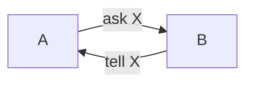
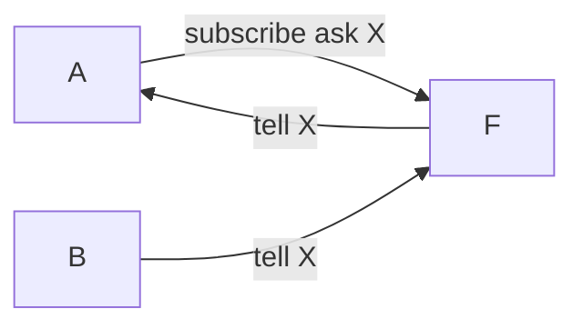
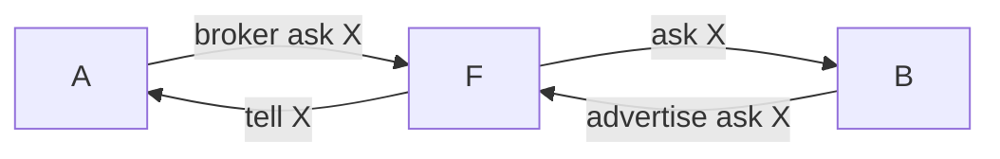
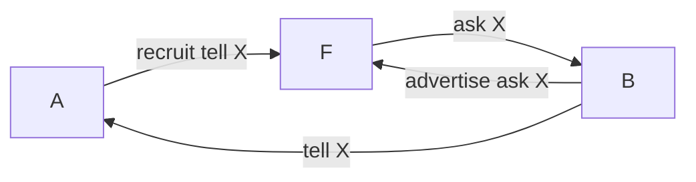
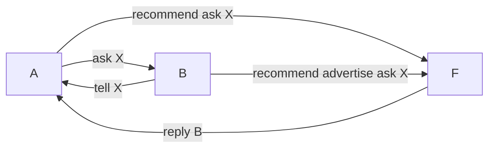

+++
title = "[Agent] Communication"
+++
### Communication between agents

에이전트들간의 커뮤니케이션을 알아보기 이전에 한 가지 용어를 정리하고자 합니다. 'Speech Act' 란 용어입니다. Speech Act는 한국어로 언어행위론 이라고 정의할 수 있습니다. 언어행위론이란 언어를 통해 이루어지는 행위를 말합니다. 나는 너를 용서한다 라고는 말하면 말로써 행위가 표현되듯 언어가 어떤 영향을 주는지에 대해 초점이 맞춰져 있습니다. 명령, 요구 등으로 나뉠 수 있죠.

그럼 이제 커뮤니케이션에 대해 정리해보겠습니다. 예를 들어서 살펴보죠. 개인비서 에이전트가 있다고 합니다. 이 에이전트에게 여러분은 김군과 저녁 약속을 잡아달라고 요청합니다. 그럼 이 에이전트를 어떠한 것들이 필요할까요? 간단히 생각해 보세요. 김군의 저녁 일정들이 필요할 것 같네요. 그리고 약속을 위한 약속장소의 정보도 필요할 것 같습니다. 약속을 잡기위한 목표를 이루기 위해 MAS가 필요할 것 같네요. 약속을 잡기 위한 전체 흐름을 살펴보죠.

먼저 DA에게 김군 일정을 관리하는 에이전트가 누군지 문의합니다. 김군의 에이전트를 모르니 정보를 알아야겠죠. DA는 모든 정보를 관리하는 중계 에이전트라고 생각하시면 됩니다. DA에서 전달받은 김군 에이전트의 정보를 이용해 약속 가능한 일정을 문의하고 답변받은 리스트 중 선택한 요일을 알려줘 약속을 최종적으로 잡게되는 흐름입니다. 생각보다 단순하죠? 위 그림에서 저렇게 에이전트간 커뮤니케이션를 어떻게 이루어지는지에 대해 살펴보게 될 것 입니다. 여기서 목표는 김군과 약속을 잡는 것으로 김군 캘린더에 나의 시간을 할당받는 것입니다. 목표를 이루기 위한 Intention으로 김군의 캘린더 에이전트를 찾는 것도 있을테구요. 그 Intention은 Speech act로 이루어 집니다. DA에게 누가 김군 캘린더를 관리하니? 란 Speech가 행위로 연결되죠.

에이전트간 커뮤니케이션을 위한 언어가 정의되어 있습니다. Agent Communication Language입니다. ACL은 다른 위치와 행동을 하는 에이전트들 간의 커뮤니케이션을 할 수 있도록 해주고 각 에이전트가 가진 정보와 지식을 교환할 수 있도록 지원해주는 역할을 합니다. 사람의 언어와 똑같은거죠. 처음엔 커뮤니케이션을 Remote Procedure Calls나 Remote Method Invocation과 같은 방식을 사용했습니다. 하지만 사람과 유사한 방식을 만들고자 노력하였고 유연하면서도 요청이나 역할을 다룰수 있는 방식으로 진화하며 만들어졌습니다.

MAS에서 커뮤니케이션은 가장 처음 설명한 Speech act 이론에서 영감을 받아 만들어졌습니다. 사람들이 매우매우 Goal과 Intention을 달성하기 위해 어떻게 언어를 사용하였는지 확인하였고 사람과 가장 유사한 방식이길 바랬습니다. 일반적으로 Speech Act는 2가지 요소로 나눠볼 수 있습니다. Performative verb(실행자)와 Propositional content(상태)입니다. 실행자는 Request, Inform 등을 행하게되고, Content는 그 정보가 되는 것이죠. 단순 예시를 들어보겠습니다.

<table class="txc-table" style="border: none; border-collapse: collapse;" border="0" width="784" cellspacing="0" cellpadding="0"><tbody><tr><td style="width: 196px; height: 33px; background-color: #ffe400; border: 1px solid #cccccc;">
&nbsp;Speech Act
</td><td style="width: 196px; height: 33px; border-bottom: 1px solid #cccccc; border-right: 1px solid #cccccc; border-top: 1px solid #cccccc;">
"문을 닫아주세요"
</td><td style="width: 196px; height: 33px; border-bottom: 1px solid #cccccc; border-right: 1px solid #cccccc; border-top: 1px solid #cccccc;">
"문을 닫혀있다"
</td><td style="width: 196px; height: 33px; border-bottom: 1px solid #cccccc; border-right: 1px solid #cccccc; border-top: 1px solid #cccccc;">
"문이 닫혀있나요?"
</td></tr><tr><td style="width: 196px; height: 24px; border-bottom: 1px solid #cccccc; border-right: 1px solid #cccccc; border-left: 1px solid #cccccc; background-color: #ffe400;">
Performative(실행자)
</td><td style="width: 196; height: 24; border-bottom: 1px solid #ccc; border-right: 1px solid #ccc;">
Request(요청)
</td><td style="width: 196; height: 24; border-bottom: 1px solid #ccc; border-right: 1px solid #ccc;">
Inform(정보)
</td><td style="width: 196; height: 24; border-bottom: 1px solid #ccc; border-right: 1px solid #ccc;">
Inquire(문의)
</td></tr><tr><td style="width: 196px; height: 24px; border-bottom: 1px solid #cccccc; border-right: 1px solid #cccccc; border-left: 1px solid #cccccc; background-color: #ffe400;">
Content(상태표현)
</td><td style="width: 196; height: 24; border-bottom: 1px solid #ccc; border-right: 1px solid #ccc;">
문이 닫혀있다.
</td><td style="width: 196; height: 24; border-bottom: 1px solid #ccc; border-right: 1px solid #ccc;">
문이 닫혀있다.&nbsp;
</td><td style="width: 196; height: 24; border-bottom: 1px solid #ccc; border-right: 1px solid #ccc;">
문이 닫혀있다.
</td></tr></tbody></table>

Speech Act에 따라 Performative는 문에 대한 요청이나 정보, 문의등이 되고 Content는 그에 따른 상태표현이 됩니다. 이렇게 Speech act는 물리적인 행위로서 간주될 수 있습니다. 행위는 선행조건(precondition) 또는 후행조건(postcondition)으로 특화될 수 있습니다. 만약 A가 B에서 t를 요청한 경우에 대해 선행 조건은 'A는 B가 t를 할 수 있다고 믿는다.' , 'A는 B가 t를 할 수 있다는걸 B가 믿는다는걸 믿는다' , 'A는 A가 t를 원한다고 믿는다' 는 조건이 될 수 있다. 후행조건은 'A가 t를 원한다고 A가 믿는걸 B는 믿는다' 라는 의미입니다. 음, 설명해 놓고나니 무슨 말인지 잘 모르겠네요. 다음에 좀 더 좋은 예시가 있다면 수정하겠습니다.

Speech Act를 기반으로 제작된 ACL은 다른 에이전트들과 효율적으로 커뮤니케이션하거나 지식 정보를 교환할 수 있도록 해줍니다. ACL의 3가지 측면(Syntax, Semantics, Pragmatics)에서 바라보면 Syntax는 어떻게 커뮤니케이션의 실볼들이 구조화되는지하는 것이며, Semantic은 심볼이 나타내는 것이 무엇인지, Pragmatics는 심볼을 어떻게 이해하는지에 관한 관점입니다. 

ACL로서 대표적인 언어 중 하나로 KQML이 있습니다. KQML은 (Knowledge Query and Manipulation Language)의 약자인데요, 에이전트 간의 지식과 정보의 교환을 위해 설계된 통신 언어입니다. 일반적으로 질문, 선언, 신뢰, 요구, 획득, 묘사, 제공 등과 같은 정보에 대한 상태를 교환하는 데 사용되는 일종의 메시지 포멧이라고 보시면 됩니다. KQML의 카테고리는 아래와 같습니다.

<table class="txc-table" style="border: none; border-collapse: collapse;" border="0" width="784" cellspacing="0" cellpadding="0"><tbody><tr><td style="width: 201px; height: 24px; background-color: #ffe400; border: 1px solid #cccccc;">
&nbsp;Category&nbsp;
</td><td style="width: 583px; height: 24px; border-bottom: 1px solid #cccccc; border-right: 1px solid #cccccc; border-top: 1px solid #cccccc; background-color: #ffe400;">
&nbsp;Performatives
</td></tr><tr><td style="width: 201px; height: 24px; border-bottom: 1px solid #cccccc; border-right: 1px solid #cccccc; border-left: 1px solid #cccccc;">
&nbsp;Basic Query
</td><td style="width: 583px; height: 24px; border-bottom: 1px solid #cccccc; border-right: 1px solid #cccccc;">
&nbsp;evaluate, ask-if, ask-one, ..&nbsp;
</td></tr><tr><td style="width: 201px; height: 24px; border-bottom: 1px solid #cccccc; border-right: 1px solid #cccccc; border-left: 1px solid #cccccc;">
&nbsp;Multi-response Query&nbsp;
</td><td style="width: 583px; height: 24px; border-bottom: 1px solid #cccccc; border-right: 1px solid #cccccc;">
&nbsp;stream-about, stream-all
</td></tr><tr><td style="width: 201px; height: 24px; border-bottom: 1px solid #cccccc; border-right: 1px solid #cccccc; border-left: 1px solid #cccccc;">
&nbsp;Response
</td><td style="width: 583px; height: 24px; border-bottom: 1px solid #cccccc; border-right: 1px solid #cccccc;">
&nbsp;reply, sorry&nbsp;
</td></tr><tr><td style="width: 201px; height: 24px; border-bottom: 1px solid #cccccc; border-right: 1px solid #cccccc; border-left: 1px solid #cccccc;">
&nbsp;Generic Informational
</td><td style="width: 583px; height: 24px; border-bottom: 1px solid #cccccc; border-right: 1px solid #cccccc;">
&nbsp;tell, achieve, cancel, ..&nbsp;
</td></tr><tr><td style="width: 201px; height: 24px; border-bottom: 1px solid #cccccc; border-right: 1px solid #cccccc; border-left: 1px solid #cccccc;">
&nbsp;Generator
</td><td style="width: 583px; height: 24px; border-bottom: 1px solid #cccccc; border-right: 1px solid #cccccc;">
&nbsp;Standby, ready, next, rest, ...&nbsp;
</td></tr></tbody></table>

KQML에는 송신자, 수신자, 그들의 주소 등 통신과 관련된 요소들을 나열한 통신 계층과 수행어로써 메시지의 성질을 정의하는 메세지 계층, 실제적인 메시지가 들어 있는 내용 계층이 있습니다. 또한 커뮤니케이션 프로토콜을 만들기 위해 도와주는 Facilitator도 포함하고 있습니다. Facilitator는 유용한 커뮤니케이션 서비스를 제공하기 위핸 에이전트들의 특별한 그룹입니다. 여기서 말하는 유용한 커뮤니케이션 서비스란 서비스 네임등록을 유지하거나 메시지를 서비스들에게 전달하거나 Content 기반의 메시지들을 Routing 하는 기능, 찾고자하는 자와 정보를 가진 에이전트를 매칭시켜주거나 하는 역할을 말합니다. Facilitator의 예시를 한번 보겠습니다.

A, B란 에이전트가 있고 F란 이름의 Facilitator가 있다고 가정합니다. 

1. A-B간 Point-to-Point Protocol

 Point-to-point protocol에선 A가 B에게 X에 대한 정보를 얻기 위해 ask(X)를 다이렉트로 하고 B또한 A에게 tell(X)로 받아들입니다.

2. Using the subscribe performative

 A -> F : subscribe(ask(X)) 
 A가 F에게 ask(X)에 대한 구독을 요청합니다.
 B- > F : tell(X)
 B가 F에게 X에 대한 정보를 알립니다.
 F -> A : tell(X)
 F가 A에게 X의 정보를 알려줍니다.
 위 방식은 F를 통해 구독을 요청하고 정보를 F를 통해 받는 방식입니다. A, B간에는 어떠한 경우도 다이렉트로 커뮤니케이션 하는 일이 없습니다.

3. Using the broker Performative

 A -> F : broker(ask(X))
 A가 F에서 X를 해결해줄 에이전트를 찾음.
 B -> F : advertise(ask(X))
 B는 F에게 X를 처리할 수 있다고 자신을 광고하고 알림
 F -> A : tell(X) and F -> B : ask(X)
 위 구조는 F가 브로커 역할을 하여 A와 B의 요청을 각각 처리해 줍니다.

4. Using the recruit performative

 A -> F : recruit(tell(X))
 tell(X)를 처리해줄 수 있는 적절한 에이전트를 찾아달라고 요청합니다.
 B -> F : advertise(ask(X))
 B는 F에게 ask(X)를 자신이 처리할 수 있는 에이전트라고 광고합니다.
 F -> B : ask(X)
 A에게 요청한 ask(X)에 적절한 B 에이전트를 찾았고 B에게 ask(X)를 보낸다.
 B -> A : tell(X)
 F를 거치지 않고 B가 A에게 다이렉트로 응답합니다.

5. Using the recommend performative

 A -> F : recommend(ask(X)) A가 F에게 ask(X)를 처리해줄 수 있는 에이전트를 추천해 달라고 요청한다.
 B -> F : advertise(ask(X)) B는 F에게 ask(X)를 처리해 줄 수 있는 에이전트라고 광고한다.
 F -> A : reply(B) F는 A에게 B가 알맞은 에이전트라고 알려준다.
 A -> B : ask(X)
 B -> A : tell(X)

위와 같이 A,B란 에이전트와 F (Facilitator)의 관계에서의 예시를 살펴보았습니다. 조금 이해가 되시나요?

그럼 KQML이 아닌 FIPA ACL에 대해 정리해보겠습니다. FIPA는 The Foundation for Intelligent Physical Agents의 약자입니다. FIPA의 목적은 에이전트 기반의 어플리케이션, 서비스들의 성공을 위해 만들어진 곳입니다. 공공의 이익을 위한 집단입니다. FIPA가 집단이면 FIPA ACL은 FIPA에서 만든 ACL이겠죠? FIPA ACL은 KQML과 매우 유사합니다. Performative도 존재하구도 Content도 존재하구요. 메시지 구조는 봉투 형태를 띄고 있습니다. 메시지 내용은 봉수 내에 들어있고 봉투에는 전송 정보만 작성되어 있는 형태입니다. 

FIPA ACL에서 기본적인 Performative는 Inform 과 Request입니다. Inform과 Request의 의미는 두 부분으로 정의할 수 있습니다. Precondition(사전조건, speech act가 성공하기 위해 진실이여야만 하는 것들) 과 Rational effect(합리적 영향, 그 메신지의 발신자가 가져오길 바라는 것)입니다. 

<table class="txc-table" style="border: none; border-collapse: collapse;" border="0" width="784" cellspacing="0" cellpadding="0"><tbody><tr><td style="width: 126px; height: 24px; border: 1px solid #cccccc;">
&nbsp;
</td><td style="width: 298px; height: 24px; border-bottom: 1px solid #cccccc; border-right: 1px solid #cccccc; border-top: 1px solid #cccccc; background-color: #ffe400;">
Inform
</td><td style="width: 359px; height: 24px; border-bottom: 1px solid #cccccc; border-right: 1px solid #cccccc; border-top: 1px solid #cccccc; background-color: #ffe400;">
Request
</td></tr><tr><td style="width: 126px; height: 24px; border-bottom: 1px solid #cccccc; border-right: 1px solid #cccccc; border-left: 1px solid #cccccc;">
Content
</td><td style="width: 298px; height: 24px; border-bottom: 1px solid #cccccc; border-right: 1px solid #cccccc;">
statement
</td><td style="width: 359px; height: 24px; border-bottom: 1px solid #cccccc; border-right: 1px solid #cccccc;">
action
</td></tr><tr><td style="width: 126px; height: 24px; border-bottom: 1px solid #cccccc; border-right: 1px solid #cccccc; border-left: 1px solid #cccccc;">
Precondition
</td><td style="width: 298px; height: 24px; border-bottom: 1px solid #cccccc; border-right: 1px solid #cccccc;">
&nbsp;Content가 사실이라고 주장.

&nbsp;수신자가 Content를 믿도록 의도.

&nbsp;미리 수행하지 않음
</td><td style="width: 359px; height: 24px; border-bottom: 1px solid #cccccc; border-right: 1px solid #cccccc;">
&nbsp;수행할 작업 내용을 의도.

&nbsp;수신자가 이 작업을 할 수 있다고 믿음.&nbsp;
</td></tr></tbody></table>

KQML과 FIPA ACL을 잠시 비료해 보죠.

KQML과 FIPA ACL의 유사한 점은 Outer Language(Performative)와 Inner Language(Content)가 분리되어 있으며 어떤 content language도 허용한다는 점입니다. 차이점은 KQML은 Performative를 FIPA ACL은 communicative act를 좀 더 중점에 두고 있다는 것과 다른 프레임워크 사용으로 KQML과 FIPA Performative 간 정확한 매핑이나 전송이 불가능하며 KQML은 facilitator를 지원하지만 FIPA ACL는 그렇지 않다는 점이죠. KQML은 무조건 중계자가 있어야 함으로 중앙 집중식 구조가 되며, Facilitator에 로드가 크다는 단점이 있을 수 있습니다.

에이전트 간 커뮤니케이션하기 위한 방법으로 Speech Act를 기반으로 만들어진 ACL과 ACL 중 가장 많이 사용되는 KQML, FIPA ACL에 대해 정리해보았습니다.

긴 글 읽어주셔서 감사합니다. 수정되어야 할 부분이나 질문있으시면 댓글로 언제든지 부탁드립니다.
