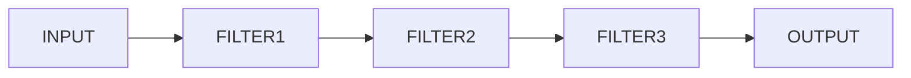

+++
title = "Batch Sequential Architecture"
tag = "S/W Architecture, Batch"
+++

Batch Sequential Architecture에 대해 정리해보겠습니다.

  

Batch Sequential Architecture는 이전 글에서 정리한 Data Flow Software Architecture 중 하나입니다. 참고가 필요하신 분은 해당 글을 확인해주세요.  

  

[\[S/W Architecture\] Data Flow Software Architectures](https://linuxias.github.io/sw_architecture/data_flow_sw_architecture/)

  

Batch Sequential Architecture는 1950~70년대에 많이 사용된 데이터 처리 모델입니다. 데이터는 하나의 서브시스템에서 다음 서브시스템으로 데이터로 전달됩니다. 각 데이터 전송 서브시스템 또는 모듈은 이전 서브시스템의 데이터 처리가 끝나기 전에는 스스로 시작할 수 없습니다. 정리하자만 A-B 로 연결된 Batch Sequential Architecture에서 B는 A가 모든 데이터 처리를 완료한 후 결과 데이터가 출력되기 전까지 스스로 독립적으로 시작할 수 없습니다. 데이터를 분리해 중간중간 처리가 아닌 하나의 서브시스템이 데이터를 처리한 전체 결과를 출력해야만 다음 서브시스템이 시작할 수 있습니다.

  

Batch Sequential Architecture를 구성하는 컴포넌트는 Program과 Data store입니다. 각 프로그램의 연결은 단방향 파이프로써 데이터 셋을 전달합니다. 아래와 같은 형태로 Batch Sequential Architecture가 구성됩니다.

  

 

Batch Sequential Architecture는 서브시스템들이 단순하게 분리되어 있고 입력 데이터와 출력 데이터에 맞춘 서브시스템의 교체도 가능합니다. 서브시스템간 연결은 오직 데이터 이므로 데이터만 맞추면 된됩니다. 하지만 외부에서 서브시스템을 제어하기 위한 구현에서는 부적합하며 인터렉션을 위한 인터페이스를 제공할 수가 없다. 오직 데이터만이 입력과 출력이기 때문입니다. 또한 동시성을 지원하지 않기 때문에 낮은 성능과 높은 Latency를 가지는게 이 아키텍처의 한계입니다.
  

이상 Batch Sequential Architecture에 대해 정리해보았습니다. 감사합니다.